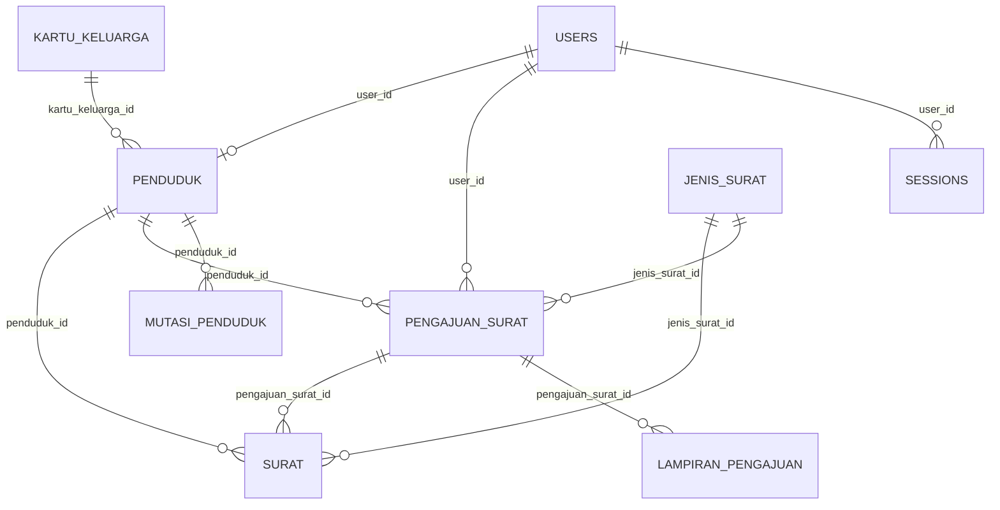

# 📊 DOKUMENTASI TABEL DATABASE — Aplikasi Kependudukan Kelurahan Ardipura

> **Judul KP**: Aplikasi Kependudukan Berbasis Web di Kelurahan Ardipura
>
> **Database**: MySQL — `KP_gealing`

---

## Diagram Relasi Antar Tabel



---

## 1. `users` — Tabel Pengguna Sistem

**Fungsi**: Menyimpan data akun pengguna yang dapat masuk ke sistem. Setiap pengguna memiliki **role** yang menentukan hak akses — `staf` mengelola seluruh data kependudukan dan surat, sedangkan `warga` hanya dapat mengajukan surat secara online dan memantau status pengajuannya.

**Dibuat oleh**: Laravel default + migration tambahan untuk `role`.

| Nama Atribut | Tipe | Ukuran | Keterangan |
|---|---|---|---|
| `id` | BIGINT (PK) | Auto | Primary key |
| `name` | VARCHAR | 255 | Nama lengkap pengguna |
| `role` | VARCHAR | 20 | `staf` / `warga` — menentukan hak akses, default `warga` |
| `email` | VARCHAR | 255 | Unique, digunakan sebagai username login |
| `email_verified_at` | TIMESTAMP | - | Nullable, waktu verifikasi email |
| `password` | VARCHAR | 255 | Password ter-hash (bcrypt) |
| `remember_token` | VARCHAR | 100 | Nullable, token untuk fitur "Remember Me" |
| `created_at` | TIMESTAMP | Auto | Waktu pembuatan akun |
| `updated_at` | TIMESTAMP | Auto | Waktu update akun |

**Peran dalam sistem**: Tabel ini menjadi pusat autentikasi dan otorisasi. Kolom `role` digunakan untuk membatasi akses — `staf` dapat mengakses semua modul pengelolaan data (penduduk, KK, surat, mutasi), sedangkan `warga` hanya dapat mengajukan surat dan melihat status pengajuannya sendiri. Setiap user `warga` terhubung ke data penduduk melalui kolom `user_id` pada tabel `penduduk`. Autentikasi dikelola oleh **Laravel Fortify** (termasuk 2FA, reset password, dan verifikasi email).

---

## 2. `kartu_keluarga` — Data Kartu Keluarga

**Fungsi**: Menyimpan data Kartu Keluarga (KK) yang terdaftar di wilayah Kelurahan Ardipura. Setiap KK memiliki **nomor unik 16 digit** dan menjadi wadah pengelompokan anggota keluarga (penduduk). Kolom lokasi diisi default sesuai wilayah kelurahan.

| Nama Atribut | Tipe | Ukuran | Keterangan |
|---|---|---|---|
| `id` | BIGINT (PK) | Auto | Primary key |
| `nomor_kk` | VARCHAR | 16 | Unique — Nomor Kartu Keluarga 16 digit |
| `alamat` | TEXT | - | Alamat lengkap sesuai KK |
| `rt` | VARCHAR | 5 | Nomor RT |
| `rw` | VARCHAR | 5 | Nomor RW |
| `kelurahan` | VARCHAR | 100 | Default: `Ardipura` |
| `kecamatan` | VARCHAR | 100 | Default: `Jayapura Selatan` |
| `kabupaten_kota` | VARCHAR | 100 | Default: `Kota Jayapura` |
| `provinsi` | VARCHAR | 100 | Default: `Papua` |
| `kode_pos` | VARCHAR | 10 | Nullable, kode pos wilayah |
| `tanggal_dikeluarkan` | DATE | - | Nullable, tanggal KK diterbitkan |
| `created_at` | TIMESTAMP | Auto | Waktu input |
| `updated_at` | TIMESTAMP | Auto | Waktu update |

**Peran dalam sistem**: Tabel ini menjadi **pengelompokan utama** data penduduk berdasarkan keluarga. Setiap penduduk terhubung ke satu KK melalui `kartu_keluarga_id` pada tabel `penduduk`. Staf kelurahan dapat melihat seluruh anggota keluarga dalam satu KK, yang berguna untuk verifikasi data saat pembuatan surat (misalnya SK Ahli Waris atau SK Pindah yang melibatkan seluruh anggota keluarga). Kolom lokasi di-default sesuai Kelurahan Ardipura untuk mempercepat input data.

---

## 3. `penduduk` — Data Penduduk

**Fungsi**: Menyimpan data lengkap penduduk yang terdaftar di Kelurahan Ardipura. Ini adalah **tabel inti** sistem — seluruh fitur (surat, pengajuan, mutasi) merujuk ke data penduduk. Setiap penduduk memiliki **NIK unik 16 digit** dan terhubung ke satu Kartu Keluarga.

| Nama Atribut | Tipe | Ukuran | Keterangan |
|---|---|---|---|
| `id` | BIGINT (PK) | Auto | Primary key |
| `nik` | VARCHAR | 16 | Unique — Nomor Induk Kependudukan 16 digit |
| `kartu_keluarga_id` | BIGINT (FK) | - | → `kartu_keluarga`, nullable. KK tempat penduduk terdaftar |
| `user_id` | BIGINT (FK) | - | → `users`, nullable. Terisi jika penduduk memiliki akun login (warga) |
| `nama_lengkap` | VARCHAR | 255 | Nama lengkap sesuai KTP |
| `tempat_lahir` | VARCHAR | 100 | Tempat lahir |
| `tanggal_lahir` | DATE | - | Tanggal lahir |
| `jenis_kelamin` | VARCHAR | 1 | `L` (Laki-laki) / `P` (Perempuan) |
| `agama` | VARCHAR | 30 | Islam, Kristen Protestan, Katolik, Hindu, Buddha, Konghucu, Kepercayaan |
| `status_perkawinan` | VARCHAR | 20 | Belum Kawin, Kawin, Cerai Hidup, Cerai Mati |
| `pendidikan_terakhir` | VARCHAR | 50 | Tidak/Belum Sekolah, SD, SLTP, SLTA, D1/D2, D3, D4/S1, S2, S3 |
| `pekerjaan` | VARCHAR | 100 | Pekerjaan saat ini |
| `kewarganegaraan` | VARCHAR | 5 | `WNI` / `WNA`, default `WNI` |
| `golongan_darah` | VARCHAR | 5 | Nullable — A, B, AB, O |
| `status_hubungan_keluarga` | VARCHAR | 30 | Kepala Keluarga, Istri, Anak, Menantu, Cucu, Orang Tua, Mertua, Famili Lain, Lainnya |
| `nama_ayah` | VARCHAR | 100 | Nullable, nama ayah kandung |
| `nama_ibu` | VARCHAR | 100 | Nullable, nama ibu kandung |
| `alamat` | TEXT | - | Alamat tempat tinggal saat ini |
| `rt` | VARCHAR | 5 | Nomor RT |
| `rw` | VARCHAR | 5 | Nomor RW |
| `status_penduduk` | VARCHAR | 20 | Tetap, Sementara, Pindah, Meninggal — default `Tetap` |
| `telepon` | VARCHAR | 20 | Nullable, nomor telepon/HP |
| `foto` | VARCHAR | 255 | Nullable, path file foto penduduk |
| `tanggal_masuk` | DATE | - | Nullable, tanggal terdaftar di kelurahan |
| `catatan` | TEXT | - | Nullable, catatan tambahan dari staf |
| `created_at` | TIMESTAMP | Auto | Waktu input |
| `updated_at` | TIMESTAMP | Auto | Waktu update |

**Peran dalam sistem**: Tabel ini adalah pusat data seluruh sistem. Semua fitur utama merujuk ke sini:
1. **Surat** — setiap surat diterbitkan untuk penduduk tertentu (`penduduk_id`)
2. **Pengajuan** — warga mengajukan surat berdasarkan data penduduknya
3. **Mutasi** — perpindahan/kelahiran/kematian dicatat untuk penduduk tertentu
4. **Kartu Keluarga** — penduduk dikelompokkan dalam satu KK melalui `kartu_keluarga_id`

Kolom `user_id` menghubungkan penduduk dengan akun login. Ketika seorang warga mendaftar akun, staf dapat menautkan akun tersebut ke data penduduknya. Penduduk tanpa `user_id` berarti belum memiliki akun login (misalnya anak-anak atau lansia yang tidak memerlukan akses ke sistem). Kolom `status_penduduk` diperbarui secara otomatis saat terjadi mutasi (pindah → `Pindah`, meninggal → `Meninggal`).

---

## 4. `jenis_surat` — Master Jenis Surat

**Fungsi**: Menyimpan daftar jenis surat yang dapat diterbitkan oleh Kelurahan Ardipura. Setiap jenis surat memiliki **kode unik**, deskripsi, persyaratan dokumen, dan **template_fields** (JSON) yang mendefinisikan field input tambahan yang berbeda-beda per jenis surat.

| Nama Atribut | Tipe | Ukuran | Keterangan |
|---|---|---|---|
| `id` | BIGINT (PK) | Auto | Primary key |
| `kode` | VARCHAR | 20 | Unique — kode jenis surat (contoh: `SK-DOM`, `SKTM`, `SK-PINDAH`) |
| `nama` | VARCHAR | 255 | Nama lengkap jenis surat |
| `deskripsi` | TEXT | - | Nullable, penjelasan kegunaan surat |
| `persyaratan` | TEXT | - | Nullable, daftar syarat dokumen yang harus dilengkapi |
| `template_fields` | JSON | - | Nullable, definisi field tambahan per jenis surat (lihat penjelasan di bawah) |
| `is_active` | BOOLEAN | - | Status aktif, default `true`. Jenis surat non-aktif tidak ditampilkan |
| `bisa_diajukan_warga` | BOOLEAN | - | Default `true`. Menentukan apakah warga bisa mengajukan surat ini secara online |
| `urutan` | INTEGER | - | Default `0`, untuk mengurutkan tampilan di daftar |
| `created_at` | TIMESTAMP | Auto | Waktu input |
| `updated_at` | TIMESTAMP | Auto | Waktu update |

**Peran dalam sistem**: Tabel ini adalah **blueprint** untuk seluruh surat yang bisa diterbitkan. Kolom `template_fields` menyimpan array JSON yang mendefinisikan field input dinamis — sehingga setiap jenis surat bisa punya form yang berbeda tanpa perlu membuat tabel terpisah. Contoh:

- **SK Domisili**: hanya butuh field `keperluan` (text)
- **SK Pindah**: butuh `alamat_tujuan`, `kelurahan_tujuan`, `kecamatan_tujuan`, `alasan_pindah`, dll
- **SK Kelahiran**: butuh `nama_bayi`, `tanggal_lahir_bayi`, `jenis_kelamin_bayi`, `anak_ke`, dll

Format JSON `template_fields`:
```json
[
  {"name": "keperluan", "label": "Keperluan", "type": "text", "required": true},
  {"name": "jenis_kelamin_bayi", "label": "Jenis Kelamin", "type": "select", "options": ["Laki-laki", "Perempuan"], "required": true}
]
```

Tipe field yang didukung: `text`, `textarea`, `number`, `date`, `select`. Data yang diisi oleh user berdasarkan template ini disimpan ke kolom `data_tambahan` (JSON) di tabel `pengajuan_surat` atau `surat`. Kolom `bisa_diajukan_warga` mengontrol surat mana yang bisa diajukan sendiri oleh warga melalui portal online. Sistem sudah di-seed dengan **13 jenis surat** standar kelurahan.

---

## 5. `pengajuan_surat` — Pengajuan Surat oleh Warga

**Fungsi**: Menyimpan data pengajuan surat yang diajukan oleh warga secara online. Setiap pengajuan memiliki **status workflow** yang menunjukkan tahapan pemrosesan oleh staf kelurahan: `menunggu` → `diproses` → `selesai` / `ditolak`.

| Nama Atribut | Tipe | Ukuran | Keterangan |
|---|---|---|---|
| `id` | BIGINT (PK) | Auto | Primary key |
| `jenis_surat_id` | BIGINT (FK) | - | → `jenis_surat`, jenis surat yang diajukan |
| `penduduk_id` | BIGINT (FK) | - | → `penduduk`, penduduk yang mengajukan |
| `user_id` | BIGINT (FK) | - | → `users`, akun warga yang mengajukan |
| `keperluan` | VARCHAR | 255 | Keperluan pengajuan surat |
| `keterangan` | TEXT | - | Nullable, keterangan tambahan dari warga |
| `data_tambahan` | JSON | - | Nullable, data dinamis sesuai `template_fields` jenis surat yang dipilih |
| `status` | VARCHAR | 20 | Status pengajuan: `menunggu`, `diproses`, `selesai`, `ditolak` — default `menunggu` |
| `catatan_staf` | TEXT | - | Nullable, feedback/catatan dari staf (misalnya alasan penolakan) |
| `tanggal_diproses` | TIMESTAMP | - | Nullable, waktu pengajuan mulai diproses |
| `created_at` | TIMESTAMP | Auto | Waktu pengajuan dibuat |
| `updated_at` | TIMESTAMP | Auto | Waktu update terakhir |

**Peran dalam sistem**: Tabel ini menjadi jembatan antara **warga** dan **staf** dalam proses pelayanan surat. Alur kerja:

1. **Warga** login → pilih jenis surat → isi form (field standar + field dinamis dari `template_fields`) → kirim pengajuan → status `menunggu`
2. **Staf** melihat daftar pengajuan masuk → review kelengkapan → ubah status ke `diproses`
3. **Staf** memverifikasi data → jika lengkap, buat surat resmi (tabel `surat`) → ubah status ke `selesai`. Jika ditolak, isi `catatan_staf` dengan alasan → ubah status ke `ditolak`
4. **Warga** dapat memantau status pengajuannya secara real-time melalui portal

Kolom `data_tambahan` menyimpan data yang diisi berdasarkan `template_fields` dari jenis surat yang dipilih — misalnya untuk SK Pindah akan berisi alamat tujuan, alasan pindah, dll.

---

## 6. `surat` — Surat Resmi yang Diterbitkan

**Fungsi**: Menyimpan data surat resmi yang telah diterbitkan oleh Kelurahan Ardipura. Surat bisa dibuat langsung oleh staf atau sebagai hasil dari pengajuan warga. Setiap surat memiliki **nomor surat unik** dan dapat dicetak (generate PDF).

| Nama Atribut | Tipe | Ukuran | Keterangan |
|---|---|---|---|
| `id` | BIGINT (PK) | Auto | Primary key |
| `nomor_surat` | VARCHAR | 255 | Unique — nomor surat resmi (contoh: `001/SK-DOM/KA/V/2026`) |
| `jenis_surat_id` | BIGINT (FK) | - | → `jenis_surat`, jenis surat yang diterbitkan |
| `pengajuan_surat_id` | BIGINT (FK) | - | → `pengajuan_surat`, nullable. Terisi jika surat dibuat berdasarkan pengajuan warga |
| `penduduk_id` | BIGINT (FK) | - | → `penduduk`, penduduk yang menjadi subjek surat |
| `perihal` | VARCHAR | 255 | Perihal/judul surat |
| `keterangan` | TEXT | - | Nullable, isi/body surat |
| `data_tambahan` | JSON | - | Nullable, data dinamis sesuai jenis surat |
| `status` | VARCHAR | 20 | Status surat: `draft`, `diterbitkan`, `dibatalkan` — default `draft` |
| `tanggal_surat` | DATE | - | Tanggal surat diterbitkan |
| `ditandatangani_oleh` | VARCHAR | 255 | Nullable, nama pejabat penandatangan |
| `jabatan_penandatangan` | VARCHAR | 255 | Nullable, jabatan pejabat penandatangan |
| `created_at` | TIMESTAMP | Auto | Waktu pembuatan |
| `updated_at` | TIMESTAMP | Auto | Waktu update |

**Peran dalam sistem**: Tabel ini menyimpan **produk akhir** dari proses pelayanan surat. Surat dapat dibuat melalui dua jalur:
- **Langsung**: Staf membuat surat dari menu "Surat" → pilih jenis → isi data → terbitkan. `pengajuan_surat_id` tetap `null`.
- **Dari Pengajuan**: Staf memproses pengajuan warga → klik "Buat Surat" → data dari pengajuan otomatis terisi → staf melengkapi nomor surat dan penandatangan → terbitkan. `pengajuan_surat_id` terisi untuk tracking.

Kolom `status` memungkinkan surat dalam tahap draft sebelum diterbitkan secara resmi. Surat dengan status `diterbitkan` dapat dicetak dalam format PDF menggunakan template yang sesuai dengan jenis suratnya.

---

## 7. `mutasi_penduduk` — Pencatatan Mutasi Penduduk

**Fungsi**: Mencatat seluruh peristiwa perpindahan penduduk di Kelurahan Ardipura. Mutasi meliputi **empat jenis**: pindah masuk (penduduk baru dari luar), pindah keluar (penduduk pindah ke wilayah lain), kelahiran (penambahan penduduk baru), dan kematian (penduduk meninggal dunia).

| Nama Atribut | Tipe | Ukuran | Keterangan |
|---|---|---|---|
| `id` | BIGINT (PK) | Auto | Primary key |
| `penduduk_id` | BIGINT (FK) | - | → `penduduk`, penduduk yang bersangkutan |
| `jenis_mutasi` | VARCHAR | 20 | Jenis mutasi: `masuk`, `keluar`, `meninggal`, `lahir` |
| `tanggal_mutasi` | DATE | - | Tanggal terjadinya mutasi |
| `asal_tujuan` | VARCHAR | 255 | Nullable — asal (untuk mutasi masuk) / tujuan (untuk mutasi keluar) |
| `alasan` | TEXT | - | Nullable, alasan perpindahan |
| `keterangan` | TEXT | - | Nullable, catatan tambahan |
| `created_at` | TIMESTAMP | Auto | Waktu pencatatan |
| `updated_at` | TIMESTAMP | Auto | Waktu update |

**Peran dalam sistem**: Tabel ini berfungsi sebagai **log perubahan demografi** kelurahan. Setiap pencatatan mutasi secara otomatis memperbarui `status_penduduk` pada tabel `penduduk`:
- Mutasi **keluar** → `status_penduduk` diubah menjadi `Pindah`
- Mutasi **meninggal** → `status_penduduk` diubah menjadi `Meninggal`
- Mutasi **masuk** → penduduk baru ditambahkan dengan `status_penduduk = Tetap`
- Mutasi **lahir** → penduduk baru (bayi) ditambahkan ke KK orang tua

Data mutasi digunakan untuk menghasilkan **laporan statistik kependudukan** (jumlah pindah masuk/keluar, kelahiran, dan kematian per periode).

---

## 8. `lampiran_pengajuan` — Lampiran Dokumen Pengajuan

**Fungsi**: Menyimpan file lampiran yang diunggah oleh warga saat mengajukan surat. Setiap pengajuan bisa memiliki **beberapa lampiran** (misalnya fotokopi KTP, KK, surat pengantar RT, dll) sesuai persyaratan jenis surat.

| Nama Atribut | Tipe | Ukuran | Keterangan |
|---|---|---|---|
| `id` | BIGINT (PK) | Auto | Primary key |
| `pengajuan_surat_id` | BIGINT (FK) | - | → `pengajuan_surat`, cascade on delete |
| `nama_file` | VARCHAR | 255 | Nama asli file yang diunggah |
| `path_file` | VARCHAR | 255 | Path penyimpanan file di server |
| `tipe_file` | VARCHAR | 50 | Kategori lampiran: KTP, KK, Foto, Pengantar RT, Akta Kelahiran, dll |
| `ukuran_file` | INTEGER | - | Nullable, ukuran file dalam bytes |
| `created_at` | TIMESTAMP | Auto | Waktu upload |
| `updated_at` | TIMESTAMP | Auto | Waktu update |

**Peran dalam sistem**: Tabel ini mendukung proses **verifikasi dokumen** oleh staf. Saat warga mengajukan surat, mereka wajib mengunggah dokumen pendukung sesuai `persyaratan` pada tabel `jenis_surat`. Staf dapat melihat dan mengunduh lampiran untuk memverifikasi kelengkapan sebelum menerbitkan surat. FK constraint menggunakan `cascadeOnDelete` — jika pengajuan dihapus, semua lampiran terkait ikut terhapus beserta file fisiknya di server.

---

### Penjelasan Alur Sistem:

1. **Staf mendaftarkan data dasar**: Kartu Keluarga → Penduduk (anggota KK)
2. **Warga mendaftar akun** → Staf menautkan akun ke data penduduk (`user_id` pada tabel `penduduk`)
3. **Warga mengajukan surat** secara online → isi form + upload lampiran → status `menunggu`
4. **Staf memproses pengajuan** → verifikasi data & lampiran → buat surat resmi → status `selesai`
5. **Staf mencatat mutasi** (pindah/lahir/meninggal) → `status_penduduk` diperbarui otomatis
6. **Dashboard** menampilkan statistik: total penduduk, komposisi (jenis kelamin, agama, pendidikan), jumlah surat terbit, pengajuan masuk, dan data mutasi per periode
