# Flowmap / Prosedur Penggunaan Website Gealin

> **Aplikasi Kependudukan Berbasis Web — Kelurahan Ardipura**

---

## 1. Flowmap Umum Sistem

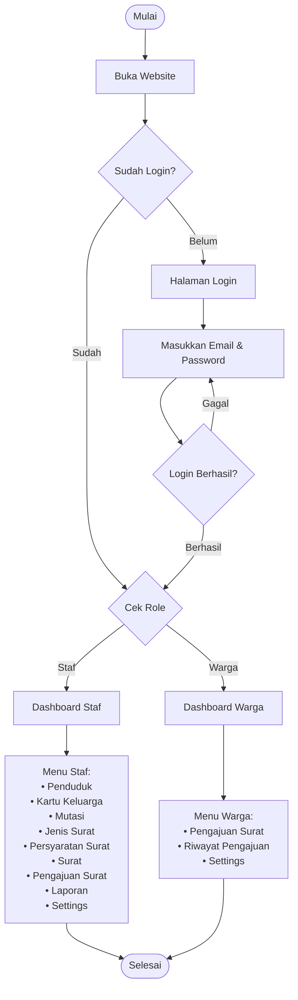

---

## 2. Prosedur Login

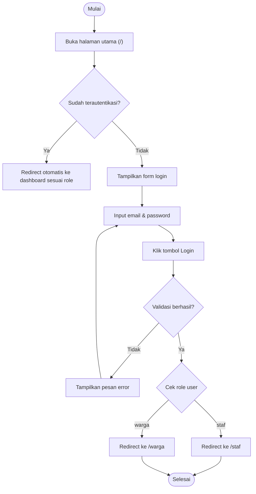

---

## 3. Prosedur Staf — Kelola Data Penduduk

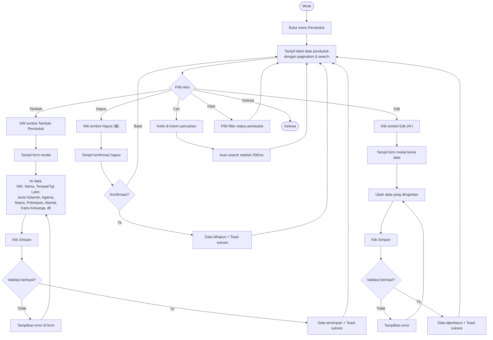

---

## 4. Prosedur Staf — Kelola Kartu Keluarga

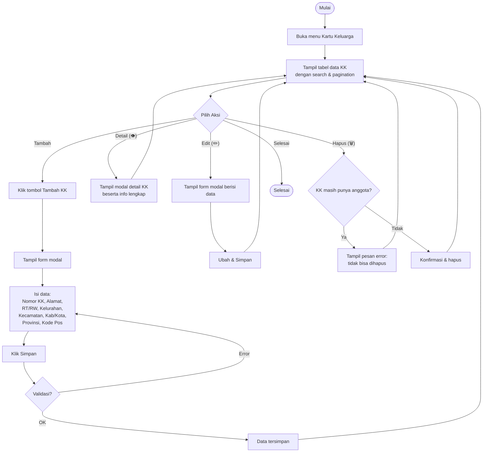

---

## 5. Prosedur Staf — Kelola Mutasi Penduduk

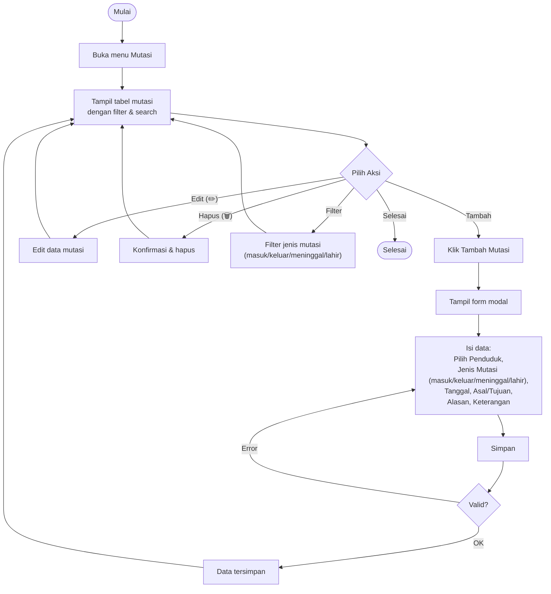

---

## 6. Prosedur Staf — Kelola Surat

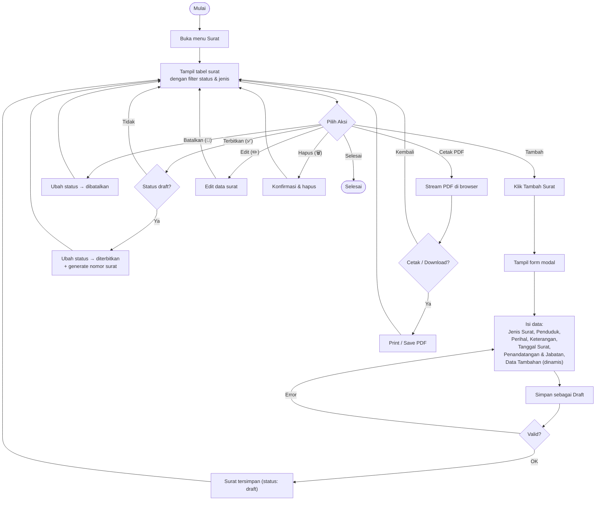

---

## 7. Prosedur Staf — Proses Pengajuan Surat

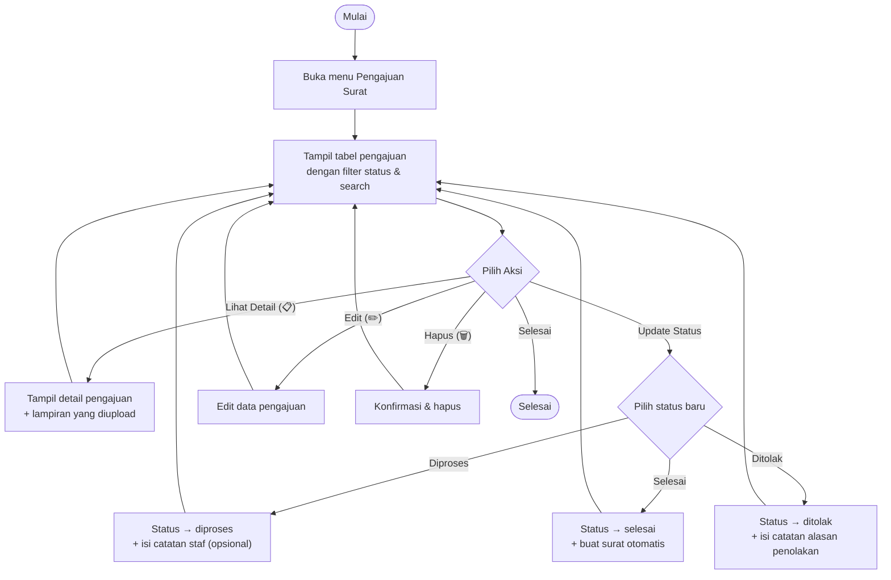

---

## 8. Prosedur Staf — Kelola Jenis Surat & Persyaratan

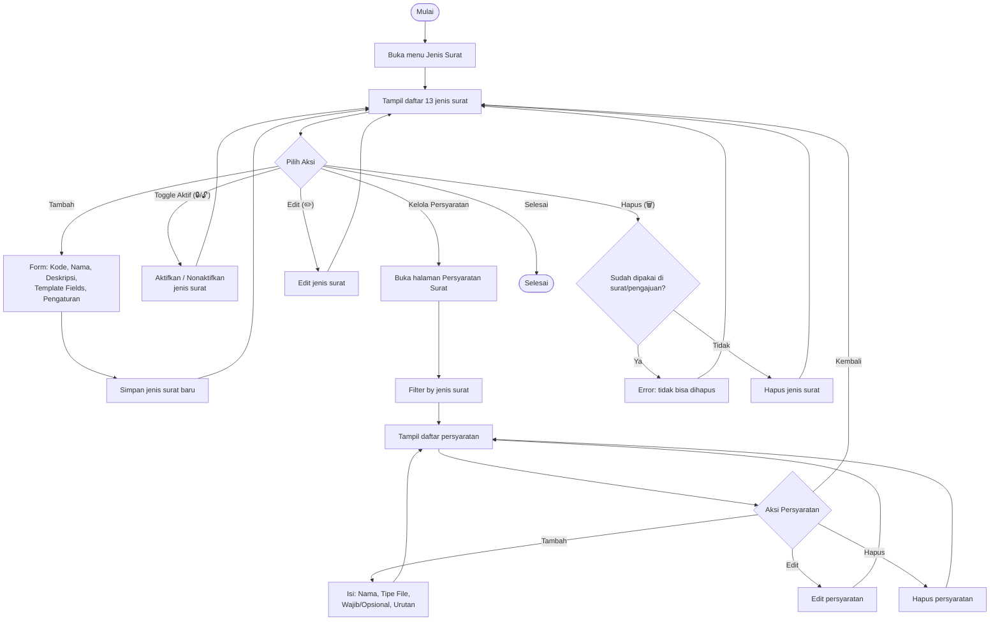

---

## 9. Prosedur Staf — Laporan

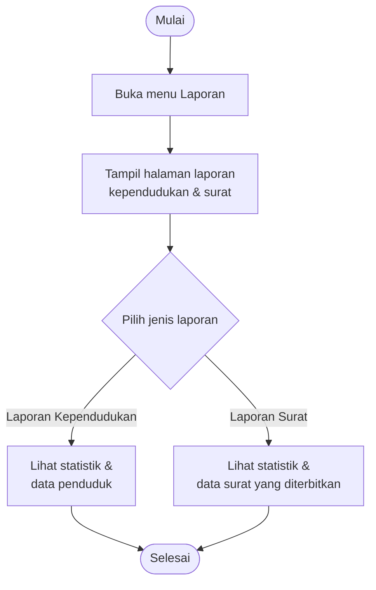

---

## 10. Prosedur Warga — Pengajuan Surat Online

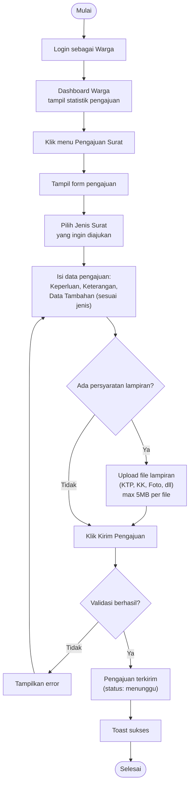

---

## 11. Prosedur Warga — Riwayat & Cetak Surat

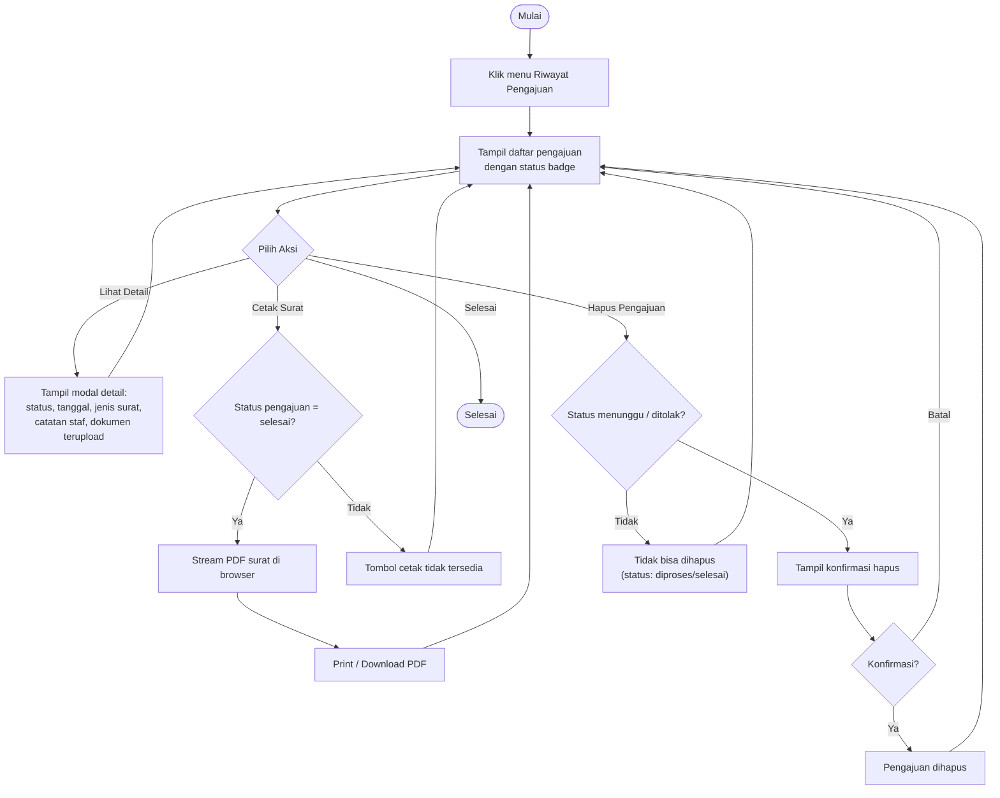

---

## 12. Flowmap Alur Pengajuan Surat (End-to-End)

> Alur lengkap dari pengajuan oleh warga hingga surat dicetak.

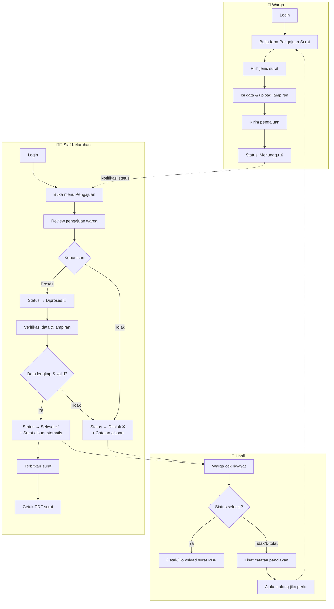

---

## 13. Prosedur Settings (Staf & Warga)

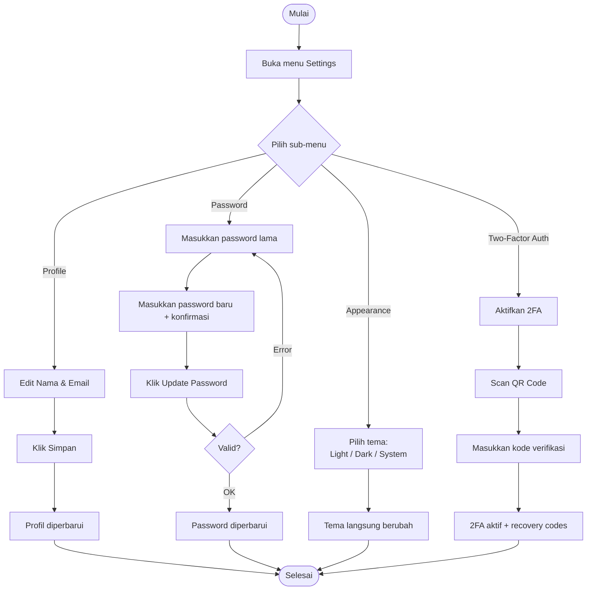

---

## Ringkasan Prosedur

| No | Prosedur | Aktor | Halaman |
|----|----------|-------|---------|
| 1 | Login | Staf / Warga | `/` |
| 2 | Kelola Penduduk (CRUD) | Staf | `/staf/penduduk` |
| 3 | Kelola Kartu Keluarga (CRUD) | Staf | `/staf/kartu-keluarga` |
| 4 | Kelola Mutasi Penduduk (CRUD) | Staf | `/staf/mutasi` |
| 5 | Kelola Surat (CRUD + Terbitkan/Batalkan + Cetak) | Staf | `/staf/surat` |
| 6 | Proses Pengajuan Surat | Staf | `/staf/pengajuan` |
| 7 | Kelola Jenis Surat (CRUD) | Staf | `/staf/jenis-surat` |
| 8 | Kelola Persyaratan Surat (CRUD) | Staf | `/staf/persyaratan-surat` |
| 9 | Laporan Kependudukan & Surat | Staf | `/staf/laporan` |
| 10 | Pengajuan Surat Online | Warga | `/warga/pengajuan` |
| 11 | Riwayat & Cetak Surat | Warga | `/warga/riwayat` |
| 12 | Pengaturan Akun | Staf / Warga | `/settings/*` |
